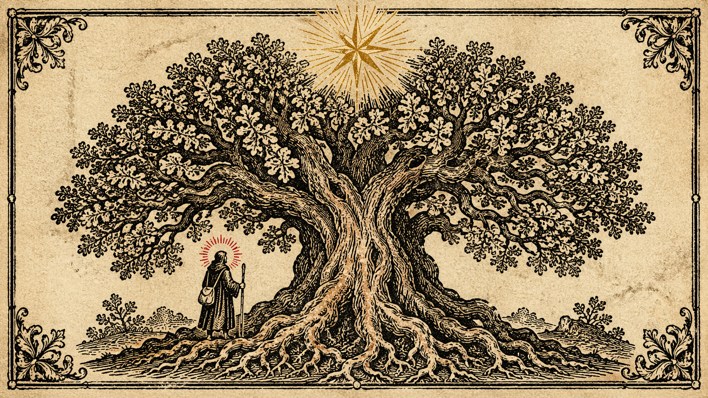
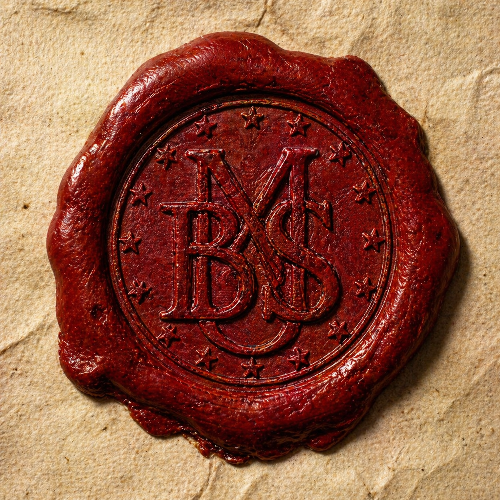
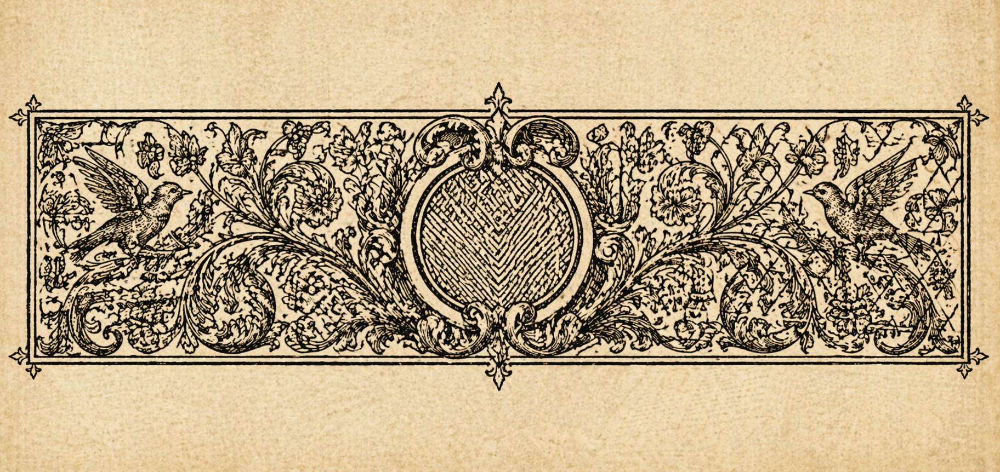

# TASK.md
# Mark Baldwin-Smith Personal Website — AI Agent Task List

This document provides granular, sequenced, modular tasks for an AI coding agent
to build the complete static website from scratch.

**Before starting:** The agent must read `STYLEGUIDE.md` in full before writing a single line
of code. All visual, typographic, and coding decisions are defined there. This task list
tells the agent *what* to build; STYLEGUIDE.md tells it *how* to build it.

---

## ⚠️ INSTRUCTIONS FOR MARK — WHERE YOU MUST INTERVENE

Tasks marked `[MARK]` require a human decision or action. The AI agent cannot complete
these tasks alone. They are gathered here for reference, and also marked inline below:

1. `[MARK — CONTENT]` Write your bio text (2–3 paragraphs). See Task 3.2.
2. `[MARK — CONTENT]` Decide which projects to include and write brief descriptions. See Task 3.3.
3. `[MARK — CONTENT]` Gather your actual URLs: music links, Substack, GitHub, email, etc. See Task 3.4.
4. `[MARK — CONTENT]` Choose a personal motto (Latin or English) for the footer and hero. See Task 2.3.
5. `[MARK — IMAGES]` Generate all images using PROMPTS.md and place them in the correct folders. See Phase 4.
6. `[MARK — DECISION]` Review the homepage before proceeding to inner pages and approve the design direction.
7. `[MARK — DEPLOY]` Follow README.md instructions to host locally and review, then deploy.

---

## PHASE 0 — PROJECT SCAFFOLDING

### Task 0.1 — Create the full directory structure

Create the following empty directory tree:

```
/
├── css/
├── js/
├── images/
│   ├── hero/
│   ├── works/
│   └── decorative/
└── fonts/          (leave empty — using Google Fonts CDN)
```

### Task 0.2 — Create placeholder image files

For every image listed in `PROMPTS.md`, create a placeholder file in the correct
`images/` subfolder with the exact filename specified. The placeholder should be
a simple 1×1 transparent PNG. This allows the HTML to reference the correct paths
immediately, without broken image errors during development.

Placeholder filenames to create:
```
images/hero/pilgrim-tree.png
images/hero/vellum-texture-bg.png
images/decorative/manuscript-portrait.png
images/decorative/folio-ornament-works.png
images/decorative/colophon-ornament.png
images/decorative/wax-seal.png
images/works/golden-thread-card.png
images/works/poetry-chapbook-card.png
images/works/kerygma-codex-card.png
images/works/essays-theology-card.png
images/works/sweet-sophia-card.png
images/works/community-vision-card.png
```

---

## PHASE 1 — CSS FOUNDATION

All CSS files must begin with a ruled comment block identifying the file and purpose.
All colour, spacing, and typography values must reference CSS custom properties from
`variables.css` — never hard-coded values elsewhere.

### Task 1.1 — Create `css/variables.css`

Define all CSS custom properties under `:root {}`. Include:

**Colours** (exact hex values — see STYLEGUIDE.md §1.2):
- `--colour-vellum: #F2E8D0`
- `--colour-vellum-shadow: #E8D9B5`
- `--colour-vellum-crease: #D4C49A`
- `--colour-ink: #1A1008`
- `--colour-ink-medium: #2D1F0E`
- `--colour-ink-faded: #5C3D1E`
- `--colour-sepia: #7A5230`
- `--colour-crimson: #8B1A1A`
- `--colour-crimson-bright: #A83232`
- `--colour-crimson-ghost: rgba(201,98,66,0.15)`
- `--colour-gold: #C8A84B`
- `--colour-white-vellum: #FAF5EA`
- `--colour-shadow-warm: rgba(26, 16, 8, 0.15)`
- `--colour-shadow-warm-deep: rgba(26, 16, 8, 0.28)`

**Typography:**
- `--font-family-fell-english: 'IM Fell English', Georgia, serif`
- `--font-family-fell-pica: 'IM Fell DW Pica', Georgia, serif`
- `--font-family-cinzel: 'Cinzel Decorative', Georgia, serif`
- `--font-size-base: 18px`
- `--font-size-small: 14px`
- `--font-size-caption: 13px`
- `--font-size-h1: clamp(2rem, 5vw, 3.8rem)`
- `--font-size-h2: clamp(1.4rem, 3vw, 2.2rem)`
- `--font-size-h3: clamp(1.1rem, 2vw, 1.5rem)`
- `--line-height-body: 1.75`
- `--line-height-heading: 1.15`
- `--letter-spacing-wide: 0.12em`
- `--letter-spacing-caps: 0.18em`

**Spacing:**
- `--space-xs: 8px`
- `--space-sm: 16px`
- `--space-md: 24px`
- `--space-lg: 40px`
- `--space-xl: 64px`
- `--space-xxl: 96px`

**Layout:**
- `--max-content-width: 900px`
- `--nav-height: 56px`

**Breakpoints** (reference only — used in media queries in other files):
- `--breakpoint-sm: 480px`
- `--breakpoint-md: 768px`
- `--breakpoint-lg: 1024px`

**Transitions:**
- `--transition-hover: 0.3s ease-out`
- `--transition-reveal: 0.8s ease-out`
- `--transition-slow: 2s ease-in-out`

---

### Task 1.2 — Create `css/base.css`

Import first in every HTML file (after variables.css). Contains:

1. **CSS reset block** — zero margins and padding on all elements, `box-sizing: border-box`
2. **`html` element** — `scroll-behavior: smooth`, base font size
3. **`body` element**:
   - Background colour: `var(--colour-vellum)`
   - Font: `var(--font-family-fell-english)`
   - Font size: `var(--font-size-base)`
   - Line height: `var(--line-height-body)`
   - Colour: `var(--colour-ink)`
   - `overflow-x: hidden`
4. **Vellum texture overlay** — `body::before` pseudo-element:
   - `position: fixed; inset: 0; pointer-events: none; z-index: 9999`
   - Apply `repeating-linear-gradient` for subtle horizontal grain lines
   - Very low opacity (0.015–0.03)
5. **Hidden SVG noise filter block** — an inline `<svg>` with `<filter id="vellum-noise-filter">` 
   using `<feTurbulence>` and `<feColorMatrix>` — referenced by the hero section background
6. **Global heading styles** — `h1, h2, h3, h4` base font, weight, line-height, colour
7. **Global link styles** — colour, text-decoration, focus outline
8. **`.visually-hidden` utility** — screen-reader-only class (position absolute, clip)
9. **`img` base rule** — `max-width: 100%; display: block; height: auto`
10. **`figure, figcaption` base styles**

---

### Task 1.3 — Create `css/layout.css`

Defines the page scaffolding. Contains:

1. **`.page-section` base class** — max-width, centred, horizontal padding
2. **`.section-content-wrapper`** — `max-width: var(--max-content-width); margin: 0 auto; padding: 0 var(--space-lg)`
3. **`.section-vertical-padding`** — `padding-top: var(--space-xxl); padding-bottom: var(--space-xxl)`
4. **`.section-header-row`** — flex row with decorative rules on either side of an `<h2>`
5. **`.section-dividing-rule`** — the horizontal rule lines flanking headings
6. **`.full-width-rule`** — a full-width `1px` horizontal rule in `var(--colour-ink)` at low opacity,
   used between sections
7. **`.ornament-divider`** — centred text element for typographic ornaments (❧ ✦ ⸿)
8. **Two-column biography layout** — `.biography-two-column-grid`
   - `display: grid; grid-template-columns: 1fr 280px; gap: var(--space-xl)`
   - Responsive: collapses to single column below `--breakpoint-md`
9. **`.reveal-on-scroll` base state** — `opacity: 0; transform: translateY(16px)`
10. **`.reveal-on-scroll.is-visible` revealed state** — `opacity: 1; transform: translateY(0)` with transition

---

### Task 1.4 — Create `css/navigation.css`

1. **`nav.site-navigation`** — sticky, top 0, z-index 100
2. Background: `var(--colour-vellum-shadow)`
3. Top and bottom border: `2px solid var(--colour-ink)`
4. Box shadow: `var(--colour-shadow-warm)`
5. Inner layout: flex, justify-content center, gap var(--space-lg)
6. **`.site-navigation__link`** — colour, font-size, letter-spacing, text-transform uppercase
7. **`.site-navigation__link::after`** — underline pseudo-element, scales in on hover from left
8. **`.site-navigation__link:hover`** — colour change to `var(--colour-crimson)`
9. **`.site-navigation__link.is-active`** — crimson colour, underline visible
10. Focus styles on all links

---

### Task 1.5 — Create `css/hero.css`

1. **`header.site-hero`**:
   - `position: relative; min-height: 100vh`
   - Display: flex, column, centre-aligned
   - Overflow: hidden
2. **`.site-hero__background-image`** — the vellum texture PNG, full bleed, `object-fit: cover`, low opacity overlay
3. **`.site-hero__central-illustration`**:
   - `position: absolute; top: 50%; left: 50%; transform: translate(-50%, -50%)`
   - Max width: `min(640px, 88vw)`
   - `opacity: 0` (animated in by JS/CSS)
4. **`.site-hero__content`** — positioned above illustration, z-index 10, text-align centre
5. **`.site-hero__name`** — Cinzel Decorative, `var(--font-size-h1)`, `var(--colour-ink)`
6. **`.site-hero__name--accent`** — span wrapping "Baldwin", colour `var(--colour-crimson)`
7. **`.site-hero__decorative-rule`** — the horizontal crimson gradient rule with central `❧`
8. **`.site-hero__epithet`** — italic, `var(--colour-sepia)`, letter-spacing
9. **`.site-hero__scroll-hint`** — "descend" text + animated vertical line at bottom of hero
10. **Corner ornament image styles** — `.site-hero__corner-ornament`, absolute positioned × 4

---

### Task 1.6 — Create `css/biography.css`

1. **`section.biography-section`** — applies `.page-section` and `.section-vertical-padding`
2. **`.biography-section__text-column`** — the main text area
3. **`.biography-section__drop-cap`** — first `::first-letter` pseudo or explicit `<span>`:
   - Font: `var(--font-family-cinzel)`
   - Size: 4rem
   - Colour: `var(--colour-crimson)`
   - Float left, appropriate margin
4. **`.biography-section__paragraph`** — body text styles, hyphens, text-justify
5. **`.biography-section__marginal-note-trigger`** — the inline spans with hidden annotation
6. **`.biography-section__marginal-note-text`** — hidden by default, shown on `:hover` or `:focus`
   - Position absolute, right side, italic, crimson, border-right
7. **`.biography-section__aside`** — the right-hand panel (wax seal, quotes)
   - Border, background, inner dashed border via pseudo-element
8. **`.biography-section__wax-seal-image`** — centred, with breathing animation class applied
9. **`.biography-section__pull-quote`** — italic small quote text inside aside
10. **`.biography-section__pull-quote cite`** — attribution styling

---

### Task 1.7 — Create `css/project-cards.css`

1. **`section.works-section`** — base section styles
2. **`.works-section__grid`** — CSS Grid, `repeat(auto-fill, minmax(260px, 1fr))`, gap var(--space-lg)
3. **`.project-card`** — base card styles:
   - Background: `rgba(242,232,208,0.6)`
   - Border: `1px solid var(--colour-ink)`
   - Padding: `var(--space-lg) var(--space-md)`
   - `display: block; text-decoration: none; color: inherit`
   - `transform: rotate(var(--project-card-tilt, 0deg))` — CSS custom property for per-card tilt
4. **`.project-card:nth-child(odd)` / `even`** — set `--project-card-tilt` to ±0.4deg
5. **`.project-card::before`** — inner border pseudo, transparent by default
6. **`.project-card:hover`**:
   - `transform: rotate(0deg) translateY(-4px)`
   - `box-shadow: var(--colour-shadow-warm-deep) + offset`
   - `::before` border becomes `var(--colour-crimson)`
7. **`.project-card__symbol`** — decorative printer's mark (❧ ✦ ⸿), crimson, large
8. **`.project-card__image`** — thumbnail image, full width, aspect-ratio 16/9, object-fit cover
9. **`.project-card__title`** — IM Fell DW Pica, 1.15rem
10. **`.project-card__description`** — italic, small, sepia
11. **`.project-card__link-hint`** — "Visit →" text, opacity 0 → 1 on card hover, translateX in
12. Transition on all animated properties

---

### Task 1.8 — Create `css/contact.css`

1. **`section.contact-section`** — centred text alignment
2. **`.contact-section__intro-text`** — italic, sepia, max-width 480px, centred
3. **`.contact-section__links-row`** — flex, justify-centre, flex-wrap, gap
4. **`.contact-link`** — uppercase, letter-spacing, border-bottom subtle
5. **`.contact-link:hover`** — crimson colour and border

---

### Task 1.9 — Create `css/animations.css`

All `@keyframes` definitions and animation utility classes. Contains:

1. `@keyframes hero-illustration-emerge` — opacity 0 → 1
2. `@keyframes hero-text-rise` — opacity 0 + translateY → visible
3. `@keyframes wax-seal-breathe` — subtle scale + drop-shadow loop
4. `@keyframes scroll-hint-pulse` — the vertical line pulsing below "descend"
5. `@keyframes section-reveal` — (used via class, not direct animation)
6. `.animation-hero-emerge` — applies hero-illustration-emerge, 3s ease-out, 0.5s delay
7. `.animation-hero-text-rise` — applies hero-text-rise, 1.5s ease-out, 2.8s delay
8. `.animation-wax-seal-breathe` — applies wax-seal-breathe, 4s ease-in-out infinite
9. `.animation-scroll-hint-pulse` — applies scroll-hint-pulse, 2s ease-in-out infinite
10. **`@media (prefers-reduced-motion: reduce)`** block:
    - Sets all animation-duration and transition-duration to `0.01ms`
    - Sets all animation-iteration-count to 1
    - Immediately shows `.animation-hero-emerge` elements as opacity 1

---

### Task 1.10 — Create `css/utilities.css`

Small helper classes:
1. `.visually-hidden` — full screen-reader-accessible hidden class
2. `.text-crimson` — colour override
3. `.text-italic` — italic
4. `.text-centered` — text-align center
5. `.ornament-character` — styles for ❧ ✦ ⸿ characters used inline
6. `.section-drop-cap` — drop cap utility (font, size, colour, float)
7. `.card-stagger-delay-1` through `-6` — `transition-delay: 0s` through `0.4s`
   (applied to project cards so they reveal in sequence)

---

## PHASE 2 — JAVASCRIPT MODULES

### Task 2.1 — Create `js/scroll-reveal.js`

Full spec in STYLEGUIDE.md §2.4. To implement:

1. Define `REVEAL_THRESHOLD = 0.12`
2. Define `OBSERVED_SELECTOR = '.reveal-on-scroll'`
3. Define `VISIBLE_CLASS = 'is-visible'`
4. `initialiseSectionRevealObserver()` — creates IntersectionObserver, observes all matching elements
5. `handleRevealIntersection(intersectionEntries)` — loops entries, adds class on `isIntersecting`
6. Stagger delay: after selecting all observed elements with `querySelectorAll`, 
   apply inline `transitionDelay` incrementally to `.project-card` elements within the works grid
   (so they reveal sequentially rather than all at once)
7. `document.addEventListener('DOMContentLoaded', initialiseSectionRevealObserver)`

---

### Task 2.2 — Create `js/navigation-behaviour.js`

1. `NAVIGATION_ELEMENT_SELECTOR = 'nav.site-navigation'`
2. `NAVIGATION_LINK_SELECTOR = '.site-navigation__link'`
3. `ACTIVE_LINK_CLASS = 'is-active'`
4. `applyActiveLinkHighlight()`:
   - Uses `IntersectionObserver` to watch all `<section>` elements with an `id`
   - When a section enters viewport at > 50% visibility, finds the matching nav link by href anchor
   - Removes `is-active` from all links, adds to the matching one
5. `initialiseNavigationBehaviour()` — calls `applyActiveLinkHighlight()`
6. `document.addEventListener('DOMContentLoaded', initialiseNavigationBehaviour)`

---

### Task 2.3 — Create `js/hero-animation.js`

Controls the hero entrance sequence. Because the hero uses a raster image (not inline SVG),
this file handles only opacity and sequence timing:

1. `HERO_ILLUSTRATION_SELECTOR = '.site-hero__central-illustration'`
2. `HERO_CONTENT_SELECTOR = '.site-hero__content'`
3. `HERO_SCROLL_HINT_SELECTOR = '.site-hero__scroll-hint'`
4. `beginHeroEntranceSequence()`:
   - Adds `.animation-hero-emerge` class to the illustration element after a 400ms delay
   - Adds `.animation-hero-text-rise` class to the content element after a 1800ms delay
   - Adds `.animation-scroll-hint-pulse` class to the scroll hint after a 4000ms delay
5. Checks `window.matchMedia('(prefers-reduced-motion: reduce)')` — if true, skips all delays and 
   immediately adds visible states
6. `document.addEventListener('DOMContentLoaded', beginHeroEntranceSequence)`

---

## PHASE 3 — HTML PAGES

### Task 3.1 — Create `index.html` — shell and head

1. DOCTYPE, `<html lang="en">`
2. `<head>` block:
   - `<meta charset="UTF-8">`
   - `<meta name="viewport" content="width=device-width, initial-scale=1.0">`
   - `<meta name="description" content="[MARK — fill in 1–2 sentence site description]">`
   - `<meta property="og:title">`, `og:description`, `og:image` (use hero image)
   - `<title>Mark Baldwin-Smith</title>`
   - Google Fonts `<link>` tags (exact string from STYLEGUIDE.md §1.3)
   - `<link rel="preload" href="images/hero/pilgrim-tree.png" as="image">`
   - CSS `<link>` tags in this exact order:
     1. `css/variables.css`
     2. `css/base.css`
     3. `css/layout.css`
     4. `css/navigation.css`
     5. `css/hero.css`
     6. `css/biography.css`
     7. `css/project-cards.css`
     8. `css/contact.css`
     9. `css/animations.css`
     10. `css/utilities.css`
3. Hidden SVG noise filter block immediately after `<body>` opens:
   ```html
   <svg aria-hidden="true" style="position:absolute;width:0;height:0;overflow:hidden;">
     <defs>
       <filter id="vellum-noise-filter">
         <feTurbulence type="fractalNoise" baseFrequency="0.75" numOctaves="4" stitchTiles="stitch"/>
         <feColorMatrix type="saturate" values="0"/>
       </filter>
     </defs>
   </svg>
   ```

---

### Task 3.2 — Build `index.html` — `<header>` hero section

Structure:
```html
<header class="site-hero" id="home">
  <!-- Corner ornaments: 4 ×  with class site-hero__corner-ornament + position class -->
  <!-- Central illustration -->
  <figure class="site-hero__illustration-figure" aria-hidden="true">
    
  </figure>
  <!-- Text content -->
  <div class="site-hero__content">
    <h1 class="site-hero__name">
      Mark <span class="site-hero__name--accent">Baldwin</span>-Smith
    </h1>
    <div class="site-hero__decorative-rule" aria-hidden="true">
      <span class="site-hero__decorative-rule-ornament">❧</span>
    </div>
    <p class="site-hero__epithet">Poet · Theologian · Songwriter · Contemplative</p>
    <!-- [MARK — MOTTO]: Replace the motto below with your preferred Latin or English phrase -->
    <p class="site-hero__motto"><em>per ardua ad lucem</em></p>
  </div>
  <!-- Scroll hint -->
  <div class="site-hero__scroll-hint" aria-hidden="true">
    <span class="site-hero__scroll-hint-text">descend</span>
    <span class="site-hero__scroll-hint-line"></span>
  </div>
</header>
```

**`[MARK — CONTENT]`** Replace the motto "per ardua ad lucem" with your own if you have one.
Consider Dante, John of the Cross, or something from your own poetry.

---

### Task 3.3 — Build `index.html` — `<nav>` navigation

```html
<nav class="site-navigation" aria-label="Main navigation">
  <a href="#about"   class="site-navigation__link">About</a>
  <a href="#works"   class="site-navigation__link">Works</a>
  <a href="#contact" class="site-navigation__link">Contact</a>
</nav>
```

Add a `<div class="full-width-rule" aria-hidden="true"></div>` below the nav.

---

### Task 3.4 — Build `index.html` — `<section id="about">` biography

Structure:
```html
<section class="biography-section page-section section-vertical-padding reveal-on-scroll" id="about">
  <div class="section-content-wrapper">
    <div class="section-header-row reveal-on-scroll">
      <div class="section-dividing-rule" aria-hidden="true"></div>
      <h2>Concerning the Author</h2>
      <div class="section-dividing-rule" aria-hidden="true"></div>
    </div>
    <div class="biography-two-column-grid">
      <!-- Main text -->
      <div class="biography-section__text-column">
        <p class="biography-section__paragraph biography-section__paragraph--with-drop-cap">
          <!-- [MARK — CONTENT] Paste your first bio paragraph here. It will receive the drop cap. -->
          Placeholder first paragraph. Replace with your own text.
        </p>
        <p class="biography-section__paragraph">
          <!-- [MARK — CONTENT] Second bio paragraph -->
          Placeholder second paragraph.
        </p>
        <p class="biography-section__paragraph">
          <!-- [MARK — CONTENT] Third bio paragraph (optional) -->
          Placeholder third paragraph.
        </p>
      </div>
      <!-- Aside -->
      <aside class="biography-section__aside reveal-on-scroll">
        
        <blockquote class="biography-section__pull-quote">
          "Beauty will save the world."
          <cite>— Dostoevsky</cite>
        </blockquote>
        <div class="ornament-divider" aria-hidden="true">✦ ✦ ✦</div>
        <blockquote class="biography-section__pull-quote">
          "The soul is that which can be touched by Being."
          <cite>— Rowan Williams</cite>
        </blockquote>
      </aside>
    </div>
  </div>
</section>
```

**`[MARK — CONTENT]`** You need to provide 2–3 paragraphs of bio text. Suggested content to cover:
- Who you are: poet, theologian, songwriter, contemplative
- Your faith tradition and its distinctive character (Anglo-Catholic, Carmelite, Hesychast, Walsingham)
- Your creative work: Golden Thread album, chapbook, Kerygma Codex
- Your location and way of life (Cambridge, boxing, Tai Chi)
- An invitation or sense of what the site offers

You may use the bio text from the prototype site as a starting point and personalise it.

**`[MARK — CONTENT]`** Optionally replace the two pull-quotes with quotes more personally
significant to you (e.g. from John of the Cross, Gregory of Nyssa, Bulgakov, Hopkins,
Dante, or your own poetry).

---

### Task 3.5 — Build `index.html` — works section header ornament image

Between the biography section and works section, insert:
```html
<div class="full-width-rule" aria-hidden="true"></div>
<figure class="folio-ornament-figure" aria-hidden="true">
  
</figure>
```

Style `.folio-ornament-figure` in `layout.css`: centred, max-width 900px, margin auto,
slight opacity (0.8) to integrate with vellum background.

---

### Task 3.6 — Build `index.html` — `<section id="works">` project cards

**`[MARK — DECISION]`** Before the agent writes this section, you need to decide:
- Which 4–6 projects to include (suggested list below — amend as needed)
- The actual URL for each project (or `#` if not yet live)
- A 1–2 sentence description you're happy with for each

**Suggested projects to include:**
1. The Golden Thread (sacred music album) — your Bandcamp or streaming link
2. Poetry Chapbook — link to Substack, a PDF, or a "coming soon" placeholder
3. The Kerygma Codex — link to document, GitHub, or Substack post
4. Essays & Theology — your Substack or a dedicated page
5. Sweet Sophia, Holy Hokhmah — a specific poem page or Substack post
6. Community Vision / Walsingham — an overview document or page

Provide this list to the agent with real URLs and descriptions filled in before proceeding.

Structure for each card:
```html
<article class="project-card reveal-on-scroll card-stagger-delay-N">
  <a href="[URL]" class="project-card__link-wrapper" target="_blank" rel="noopener noreferrer">
    <figure class="project-card__image-figure">
      
    </figure>
    <span class="project-card__symbol" aria-hidden="true">❧</span>
    <h3 class="project-card__title">[Project Title]</h3>
    <p class="project-card__description">[Short description in italic.]</p>
    <span class="project-card__link-hint">Visit <span aria-hidden="true">→</span></span>
  </a>
</article>
```

Replace `card-stagger-delay-N` with `card-stagger-delay-1` through `card-stagger-delay-6`.
Alternate the `project-card__symbol` character between `❧`, `✦`, and `⸿` per card.

Wrap all cards in:
```html
<section class="works-section page-section section-vertical-padding" id="works">
  <div class="section-content-wrapper">
    <div class="section-header-row reveal-on-scroll">...</div>
    <div class="works-section__grid">
      [cards here]
    </div>
  </div>
</section>
```

---

### Task 3.7 — Build `index.html` — `<section id="contact">` contact section

**`[MARK — CONTENT]`** Provide your actual contact details before the agent writes this section:
- Email address (or a contact form URL)
- Substack URL
- Bandcamp URL
- GitHub URL (optional)
- Any other relevant links (Instagram, Twitter/X, Facebook, etc.)

Structure:
```html
<section class="contact-section page-section section-vertical-padding reveal-on-scroll" id="contact">
  <div class="section-content-wrapper">
    <div class="section-header-row reveal-on-scroll">
      <div class="section-dividing-rule"></div>
      <h2>Correspondence</h2>
      <div class="section-dividing-rule"></div>
    </div>
    <!-- [MARK — CONTENT] Replace placeholder text with your own warm, personal invitation to connect -->
    <p class="contact-section__intro-text reveal-on-scroll">
      Letters, commissions, and theological conversation are welcome.<br>
      I am found in the usual places.
    </p>
    <nav class="contact-section__links-row reveal-on-scroll" aria-label="Contact and social links">
      <a href="mailto:[YOUR-EMAIL]" class="contact-link">Post a Letter</a>
      <a href="[SUBSTACK-URL]" class="contact-link" target="_blank" rel="noopener noreferrer">Substack</a>
      <a href="[BANDCAMP-URL]" class="contact-link" target="_blank" rel="noopener noreferrer">Bandcamp</a>
      <!-- Add or remove links as needed -->
    </nav>
    <figure class="colophon-ornament-figure reveal-on-scroll" aria-hidden="true">
      
    </figure>
  </div>
</section>
```

---

### Task 3.8 — Build `index.html` — `<footer>`

```html
<footer class="site-footer">
  <div class="site-footer__content">
    <p class="site-footer__name-line">Mark Baldwin-Smith</p>
    <p class="site-footer__motto"><em>per ardua ad lucem</em></p>
    <!-- [MARK — CONTENT] Replace motto if changed above -->
    <p class="site-footer__made-line">Made with ink &amp; intention · England</p>
    <p class="site-footer__copyright">
      <small>&copy; <span id="footer-current-year"></span> Mark Baldwin-Smith. All rights reserved.</small>
    </p>
  </div>
</footer>
```

Add a small inline script at the bottom of `<body>` (before the JS module `<script>` tags) to
set the current year:
```html
<script>
  document.getElementById('footer-current-year').textContent = new Date().getFullYear();
</script>
```

Then add the three JS module `<script>` tags at the bottom of `<body>`:
```html
<script src="js/scroll-reveal.js" defer></script>
<script src="js/navigation-behaviour.js" defer></script>
<script src="js/hero-animation.js" defer></script>
```

Add CSS for the footer in a `/* ── Footer ── */` section at the bottom of `layout.css`:
- `border-top: 2px solid var(--colour-ink)`
- Centred text, italic, small, `var(--colour-sepia)`
- Vertical padding `var(--space-xl)`

---

## PHASE 4 — IMAGES

### Task 4.1 — Generate images

**`[MARK — ACTION]`** This entire phase is yours to complete. The AI agent cannot generate images.

Steps:
1. Open ChatGPT (with DALL·E enabled — you need ChatGPT Plus or the API)
2. Start a new conversation
3. Paste the **Master Aesthetic Brief** from `PROMPTS.md` first
4. Wait for confirmation, then paste each numbered prompt in order
5. Generate 2–3 variations per image and choose the best
6. Download as PNG
7. (Optional) Compress at TinyPNG.com or Squoosh.app — target < 400KB
8. Rename files exactly as specified in each prompt's "Save to:" line
9. Place each file in the corresponding folder under `images/`

**Priority order** (do these first, as the site will look very incomplete without them):
1. `images/hero/pilgrim-tree.png` — appears immediately on page load
2. `images/decorative/wax-seal.png` — visible in bio section
3. All 6 `images/works/` card images
4. `images/decorative/folio-ornament-works.png`
5. `images/decorative/colophon-ornament.png`
6. `images/hero/vellum-texture-bg.png` (lowest priority — vellum is handled in CSS already)

---

### Task 4.2 — Integrate hero image

Once `images/hero/pilgrim-tree.png` is placed, review the hero section in a browser.
Adjust the following if needed:
- The image's `width` and `height` attributes in the HTML (use the actual image dimensions)
- The CSS `max-width` of `.site-hero__central-illustration` — may need tuning depending on
  how dense the generated image is
- If the text overlay is hard to read over the image, add a subtle `background: var(--colour-vellum-ghost)` 
  semi-transparent wash to `.site-hero__content`

---

### Task 4.3 — Integrate project card images

Once all `images/works/` images are placed:
- Confirm `aspect-ratio: 16/9` displays correctly on each card
- If an image has significantly different proportions, adjust `object-fit` and add explicit
  height to the `.project-card__image-figure`
- Add a thin crimson bottom border to each card image as a separator from the text:
  `border-bottom: 1px solid var(--colour-vellum-crease)` on `.project-card__image`

---

## PHASE 5 — REVIEW & REFINEMENT

### Task 5.1 — Cross-browser and responsive review checklist

The agent should validate the following after build completion:

- [ ] Page loads without console errors
- [ ] All images load (no broken image icons)
- [ ] Fonts load correctly (IM Fell English, IM Fell DW Pica, Cinzel Decorative)
- [ ] Hero entrance animation plays correctly on first load
- [ ] Navigation sticky behaviour works correctly
- [ ] Active nav link highlights as sections scroll into view
- [ ] All project cards have their tilt applied
- [ ] Project cards reveal in staggered sequence on scroll
- [ ] Wax seal breathing animation runs
- [ ] Drop cap appears on first biography paragraph
- [ ] Marginal notes appear on hover
- [ ] All links have visible focus outlines
- [ ] Footer year is correct
- [ ] Responsive: test at 320px, 480px, 768px, 1024px, 1440px widths
- [ ] Biography grid collapses to single column on mobile
- [ ] Project grid collapses appropriately on small screens
- [ ] `prefers-reduced-motion` disables animations (test in browser devtools)

---

### Task 5.2 — Validate HTML and CSS

- Run `index.html` through the W3C HTML validator (validator.w3.org)
- Run each CSS file through the W3C CSS validator (jigsaw.w3.org)
- Fix any errors or warnings reported

---

### Task 5.3 — Final content pass

**`[MARK — REVIEW]`** Once the site is built with placeholder content, you should:
1. Replace all bio paragraph placeholders with your real text
2. Replace all project card descriptions with your real descriptions
3. Replace all `href="#"` links with real URLs
4. Replace contact detail placeholders with real details
5. Confirm the motto in the hero and footer is the one you want
6. Read the site aloud — does it sound like you?

---

## PHASE 6 — OPTIONAL ENHANCEMENTS

These are not required for launch but improve the site.

### Task 6.1 — Add marginal annotation interactivity (keyboard accessible)

The biography section's marginal notes currently appear on CSS `:hover` only.
Improve accessibility: add `tabindex="0"` to each `.biography-section__marginal-note-trigger` span,
and in `js/navigation-behaviour.js` (or a new file), add a `focus`/`blur` event pair that 
adds/removes a `.is-focused` class, which `biography.css` uses to show the annotation
(matching the `:hover` state).

### Task 6.2 — Add a "print this page" stylesheet

Create `css/print.css` linked with `media="print"`. It should:
- Show `var(--colour-ink)` text on white background
- Remove all animations
- Remove the nav and footer
- Show the biography and projects in a clean single-column layout
- Show the URL of each project card after its title

### Task 6.3 — Add Open Graph and Twitter card meta tags

In the `<head>` of `index.html`:
- `og:title`, `og:description`, `og:image` (use the hero illustration PNG)
- `og:type: website`
- `twitter:card: summary_large_image`
- `twitter:title`, `twitter:description`, `twitter:image`

**`[MARK — CONTENT]`** Write a 1–2 sentence meta description and OG description here first.

### Task 6.4 — Add a 404.html page

A simple, in-aesthetic 404 page:
- Same base styles, same fonts
- A woodcut ornament image (`images/decorative/colophon-ornament.png`)
- Heading: "This page has wandered off the path."
- Link back to `index.html`: "Return to the beginning"
- No nav required

---

*End of TASK.md*
